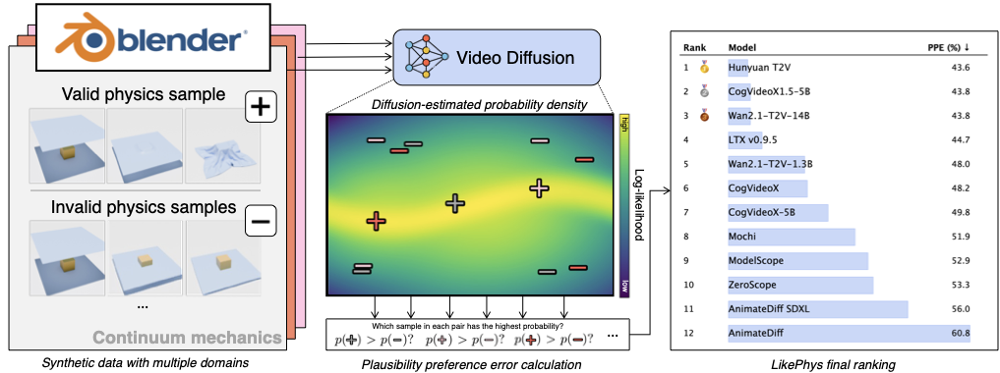

# LikePhys: Evaluating intuitive physics understanding in video diffusion models via likelihood preference

## Abstract

Intuitive physics understanding in video diffusion models plays an essential role in building general-purpose physically plausible world simulators, yet accurately evaluating such capacity remains a challenging task due to the difficulty in disentangling physics correctness from visual appearance in generation. To the end, we introduce *LikePhys*, a training-free method that evaluates intuitive physics in video diffusion models by distinguishing physically valid and impossible videos using the denoising objective as an ELBO-based likelihood surrogate on a curated dataset of valid-invalid pairs.


## Overview



We benchmark 9 state-of-the-art video diffusion models across 12 physics scenarios covering rigid body dynamics, fluid dynamics, deformable materials, and optics. Our evaluation metric, Plausibility Preference Error (PPE), demonstrates strong alignment with human preferences and reveals significant variations in physics understanding across different models and physical domains.

## Usage

### Quick Start

1. **Setup Environment**:
```bash
# Clone repository
git clone https://github.com/YuanJianhao508/LikePhys-Benchmark.git
cd LikePhys-Benchmark

# Install dependencies
pip install torch torchvision diffusers accelerate transformers
pip install opencv-python pillow numpy matplotlib tqdm

# The dataset is already included in the data/ folder
```

2. **Run Single Evaluation**:
```bash
python evaluator.py --model animatediff --data ball_drop --seed 42 --guidance_scale
```

3. **Run Batch Evaluation**:
```bash
bash run_eval.sh
```

### Command Line Arguments

- `--model`: Model to evaluate (e.g., `animatediff`, `cogvideox`, `hunyuan_t2v`, `ltx`, `mochi`)
- `--data`: Physics scenario to test (e.g., `ball_drop`, `ball_collision`, `pendulum`)
- `--seed`: Random seed for reproducibility
- `--guidance_scale`: Use classifier-free guidance (flag)
- `--tag_name`: Custom tag for organizing experiment results

### Sample Scripts

#### Single Model Evaluation
```bash
# Evaluate a single model on one physics scenario
python evaluator.py \
    --model animatediff \
    --data ball_drop \
    --seed 42 \
    --guidance_scale \
    --tag_name "experiment_1"
```

#### Batch Evaluation
```bash
# Run comprehensive evaluation across all models and scenarios
bash run_eval.sh
```

## Dataset

The physics scenario videos are included in the `data/` directory. The dataset contains paired videos (physically plausible vs. implausible) across 12 different physics scenarios.


## Supported Models

- **AnimateDiff** (`animatediff`)
- **AnimateDiff SDXL** (`animatediff_sdxl`)
- **CogVideoX** (`cogvideox`, `cogvideox-5b`)
- **Hunyuan Video** (`hunyuan_t2v`, `hunyuan_i2v`)
- **LTX Video** (`ltx`, `ltx-0.9.1`, `ltx-0.9.5`)
- **Mochi** (`mochi`)
- **ModelScope** (`modelscope`)
- **Stable Video Diffusion** (`svd`)
- **Wan Video** (`wan2.1-T2V-1.3b`, `wan2.1-T2V-14b`)
- **ZeroScope** (`zeroscope`)

## Physics Scenarios

The benchmark covers 12 scenarios across 4 physics domains:

### Rigid Body Dynamics
1. **Ball Drop** (`ball_drop`) - Gravity and collision with ground
2. **Ball Collision** (`ball_collision`) - Momentum conservation in collisions
3. **Pendulum** (`pendulum`) - Harmonic motion and energy conservation
4. **Block Slide** (`block_slide`) - Friction and inclined plane dynamics
5. **Pyramid Collapse** (`pyramid`) - Multi-body collision dynamics

### Fluid Dynamics
6. **Fluid Droplet** (`fluid`) - Droplet falling and surface tension
7. **Faucet Flow** (`faucet`) - Continuous fluid flow mechanics
8. **River Flow** (`river`) - Complex fluid dynamics with obstacles

### Deformable Materials
9. **Cloth Drape** (`cloth`) - Soft body physics and draping
10. **Flag Motion** (`flag`) - Cloth-wind interaction

### Optics
11. **Shadow Casting** (`shadow`) - Light source movement and shadow consistency
12. **Camera Motion** (`shadowm`) - Perspective changes and shadow stability

## Project Structure

```
LikePhys-Benchmark/
├── data/                     # Physics scenario datasets (included)
│   ├── ball_drop_videos/     # Ball drop test cases
│   ├── ball_collision_videos/ # Collision scenarios
│   ├── pendulum_videos/      # Pendulum motions
│   └── ...                   # Other physics scenarios
├── pipeline/                 # Model pipeline implementations
│   ├── animatediff_pipeline.py
│   ├── cogvideox_new_pipeline.py
│   ├── hunyuan_t2v_pipeline.py
│   ├── hunyuan_i2v_pipeline.py
│   ├── ltx_pipeline.py
│   ├── mochi_pipeline.py
│   ├── modelscope_pipeline.py
│   ├── svd_pipeline.py
│   ├── wan_pipeline.py
│   ├── zeroscope_pipeline.py
│   └── ...                   # Other model pipelines
├── scheduler/                # Custom schedulers
│   ├── euler_discrete.py
│   └── unipc_multistep.py
├── utils/                    # Utility functions
│   ├── video_utils.py        # Video processing
│   └── image_scraper.py      # Image utilities
├── assets/                   # Images for documentation
│   ├── method.png
│   ├── teaser.png
│   └── dataset.png
├── evaluator.py              # Main evaluation script
├── read_exp_final.py         # Results analysis
└── run_eval.sh              # Batch evaluation script
```

## Results Analysis

After evaluation, use the analysis script to compute PPE (Plausibility Preference Error) and generate rankings:

```bash
python read_exp_final.py
```


## Citation

If you use LikePhys in your research, please cite:

```bibtex
@article{yuan2025likephys,
  title={LikePhys: Evaluating Intuitive Physics Understanding in Video Diffusion Models via Likelihood Preference},
  author={Yuan, Jianhao and Pizzati, Fabio and Pinto, Francesco and Kunze, Lars and Laptev, Ivan and Newman, Paul and Torr, Philip and De Martini, Daniele},
  journal={arXiv preprint arXiv:2510.11512},
  year={2025}
}
```

## License

Apache License 2.0
