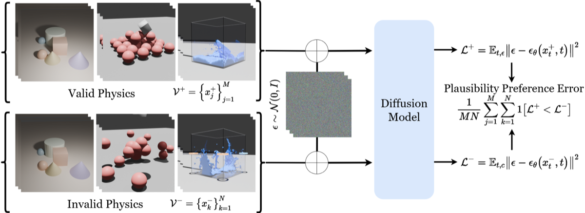
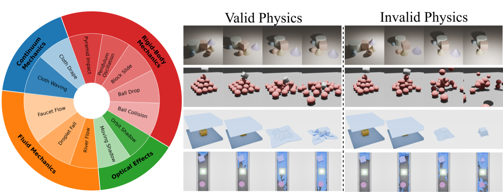

# LikePhys: Evaluating intuitive physics understanding in video diffusion models via likelihood preference

## Abstract

Intuitive physics understanding in video diffusion models plays an essential role in building general-purpose physically plausible world simulators, yet accurately evaluating such capacity remains a challenging task due to the difficulty in disentangling physics correctness from visual appearance in generation. To the end, we introduce *LikePhys*, a training-free method that evaluates intuitive physics in video diffusion models by distinguishing physically valid and impossible videos using the denoising objective as an ELBO-based likelihood surrogate on a curated dataset of valid-invalid pairs.



## Overview


We benchmark state-of-the-art video diffusion models across 12 physics scenarios covering rigid body dynamics, fluid dynamics, deformable materials, and optics. Our evaluation metric, Plausibility Preference Error (PPE), demonstrates strong alignment with human preferences and reveals significant variations in physics understanding across different models and physical domains.

## Release Plan

The codebase is temporarily under embargo while we prepare the public release.

In the meantime, please refer to the illustrations above for a high-level
overview of the method and dataset.

## Dataset (illustration)

Detailed dataset links and access instructions will be shared upon public release.




## Citation

If you use LikePhys in your research, please cite:

```bibtex
TODO
```


